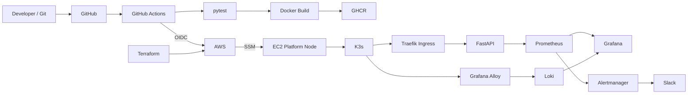
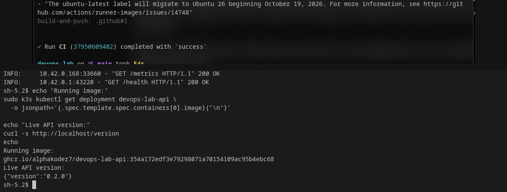
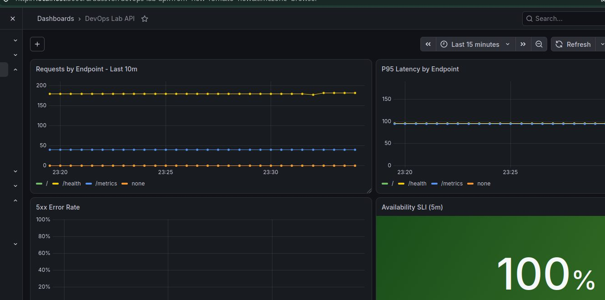
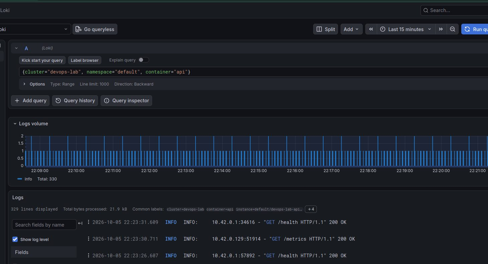
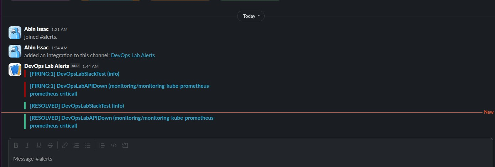

# DevOps Lab

A hands-on DevOps/SRE platform project that takes a small FastAPI service through the full delivery and operations lifecycle:

**code → test → container image → registry → AWS → Kubernetes → automated deployment → metrics, logs, alerts and recovery**

The application is intentionally small. The project is about the platform around it: infrastructure as code, CI/CD, Kubernetes operations, observability, reliability targets, and incident response.

## What this project demonstrates

- Linux-first development on Pop!_OS
- FastAPI application with pytest coverage
- Docker image build and GitHub Container Registry publishing
- GitHub Actions CI/CD with path-aware workflows
- GitHub OIDC authentication to AWS without long-lived AWS access keys
- Terraform-managed AWS networking, IAM and EC2 infrastructure
- Remote administration and deployments through AWS Systems Manager instead of public SSH
- K3s, Traefik and Helm-based application deployment
- Prometheus metrics and Grafana dashboards
- Loki + Grafana Alloy centralized Kubernetes logging
- Prometheus alert rules routed through Alertmanager to Slack
- Availability SLI, 99.5% SLO and 0.5% error budget
- Incident runbook and tested outage/recovery workflow
- Persistent local-path storage for Prometheus and Loki

## Architecture



## Delivery flow

Application or Helm changes trigger the application workflow:

```text
git push
   ↓
pytest
   ↓
Docker build
   ↓
GHCR image tagged with the Git commit SHA
   ↓
GitHub Actions assumes an AWS role using OIDC
   ↓
AWS Systems Manager runs the deployment on the platform node
   ↓
helm upgrade --install
   ↓
Kubernetes rollout verification
```

Observability changes use a separate path-filtered workflow, so monitoring or logging changes do not unnecessarily rebuild and redeploy the application.

### Deployment proof

The running Kubernetes image is tied to the Git commit used by CI, and the live application reports the expected version.



## AWS platform

Terraform provisions the core platform in `ap-south-1`:

- VPC `10.0.0.0/16`
- two public subnets
- internet gateway and route table
- Amazon Linux 2023 EC2 platform node
- IAM instance profile with Systems Manager access
- security group exposing HTTP on port 80
- no public SSH ingress
- 20 GiB gp3 root volume

The platform node runs a single-node K3s cluster. Traefik receives public HTTP traffic and routes it through Kubernetes Ingress to the FastAPI service.

## Kubernetes and Helm

The application is packaged as a Helm chart under `helm/devops-lab-api/`.

The chart manages:

- Deployment
- Service
- Ingress
- ServiceMonitor
- PrometheusRule

Current application version: `0.2.0`.

## Observability

### Metrics and SLI

Prometheus scrapes the API through a ServiceMonitor. Grafana shows request volume, p95 latency, 5xx rate, and the availability SLI.



Reliability target:

- **SLO:** 99.5% availability
- **Error budget:** 0.5%

The complete SLI/SLO definition is in [docs/reliability.md](docs/reliability.md).

### Centralized logs

Grafana Alloy discovers Kubernetes pod logs and sends them to Loki. Loki is provisioned as a Grafana datasource so application logs can be queried alongside metrics.



Example LogQL:

```logql
{cluster="devops-lab", namespace="default", container="api"}
```

### Alerting and incident response

Current application alerts include:

- `DevOpsLabAPIDown` — API cannot be scraped for at least 1 minute
- `DevOpsLabAPIHigh5xxRate` — more than 5% of requests return 5xx for at least 2 minutes

Alertmanager sends firing and resolved notifications to Slack. The outage path was tested by taking the application down, observing the FIRING notification, restoring the deployment, and confirming the RESOLVED notification.



The API-down response procedure is documented in [docs/runbook-api-down.md](docs/runbook-api-down.md).

## Persistence

The lab uses K3s `local-path` persistent volumes:

- Prometheus: 5 GiB
- Loki: 5 GiB

Prometheus retention is currently 3 days, which keeps the footprint reasonable for the single-node lab while still supporting short-window SRE analysis.

## Repository structure

```text
.
├── .github/workflows/
│   ├── ci.yaml
│   └── observability.yaml
├── app/
├── docs/
│   ├── images/
│   ├── reliability.md
│   └── runbook-api-down.md
├── helm/devops-lab-api/
├── infra/terraform/
├── logging/
│   ├── alloy-values.yaml
│   └── loki-values.yaml
├── monitoring/
│   ├── devops-lab-api-dashboard.json
│   ├── kustomization.yaml
│   └── values.yaml
├── tests/
├── Dockerfile
├── compose.yaml
└── requirements-dev.txt
```

## Operational checks

Useful checks on the platform node:

```bash
sudo k3s kubectl get pods -A
sudo k3s kubectl get pvc -A
sudo k3s kubectl rollout status deployment/devops-lab-api --timeout=120s
curl -s http://localhost/health
curl -s http://localhost/version
```

The platform is administered through AWS Systems Manager, so these commands are run inside the SSM shell rather than over SSH.

## Project status

| Area | Status |
| --- | --- |
| Application and tests | ✅ |
| Containers | ✅ |
| CI and image publishing | ✅ |
| AWS / Terraform | ✅ |
| Kubernetes / Helm | ✅ |
| Automated application deployment | ✅ |
| Automated observability deployment | ✅ |
| Metrics and dashboards | ✅ |
| Centralized logging | ✅ |
| Alerting and Slack notifications | ✅ |
| SLI / SLO / error budget | ✅ |
| Incident runbook and recovery test | ✅ |
| Observability persistence | ✅ |

This repository is now a complete small-scale DevOps/SRE portfolio project rather than just an application repository.
